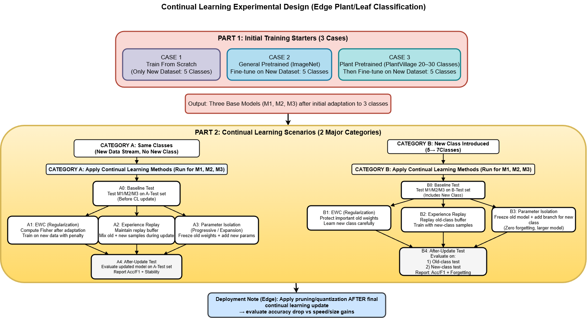

# Continual Learning for Plant Disease Detection

> Deep learning-based continual learning research for accurate plant disease classification with dynamic adaptation to new diseases over time.



**Version:** 1.0  
**Status:** Complete Research Phase  
**License:** MIT

---

## 📋 Table of Contents

- [Overview](#overview)
- [Research Objectives](#research-objectives)
- [Methodology](#methodology)
- [Project Structure](#project-structure)
- [Key Results](#key-results)
- [Getting Started](#getting-started)
- [Documentation](#documentation)
- [Dataset & Specifications](#dataset--specifications)
- [Citation](#citation)

---

## Overview

This project investigates **continual learning (CL) techniques** for plant disease detection using deep convolutional neural networks. The research addresses the challenge of adapting pre-trained models to new plant disease classes without catastrophic forgetting of previously learned knowledge.

### Problem Statement
- **Challenge**: Agricultural models must adapt to new disease variants without forgetting existing knowledge
- **Solution**: Systematic study of continual learning methods (EWC, Experience Replay, Parameter Isolation, Naive Fine-tuning)
- **Architecture**: MobileNetV3-Small for edge-compatible inference
- **Dataset**: PlantVillage Dataset (54,306 images, 38 classes, 14 crop species)

### Key Innovation
Layer-wise adaptation strategy based on feature hierarchy:
- **Group 1 (G1)**: Universal early features → Frozen
- **Group 2 (G2)**: Plant-domain features → Selective updates
- **Group 3 (G3)**: Disease-specific features → Full adaptation
- **Group 4 (G4)**: Task head → Modification for new classes

---

## Research Objectives

### Phase 1: Baseline Training (3 Cases)
| Case | Initialization | Transfer Source | Objective |
|------|---|---|---|
| **Case 1** | Scratch | None | Establish baseline from random init |
| **Case 2** | ImageNet | ImageNet pre-trained weights | Domain-generic transfer learning |
| **Case 3** | PlantVillage | PlantVillage pre-trained (26 classes) | Domain-specific transfer learning |

**Output**: Baseline models trained on 5 tomato disease classes

### Phase 2: Continual Learning (2 Categories × 4 Methods × 2 Cycles)

#### Category A: Same-Class Learning
- **Objective**: Learn new data streams of same 5 tomato classes
- **Methods**: EWC, Experience Replay, Parameter Isolation, Naive Fine-tuning
- **Evaluation**: Stability vs plasticity trade-off

#### Category B: New-Class Learning  
- **Objective**: Expand from 5 classes → 7 classes (add Septoria_leaf_spot, Spider_mites)
- **Methods**: Same 4 methods with head expansion
- **Evaluation**: Forward transfer, backward transfer, learning efficiency

---

## Methodology

### 1. Continual Learning Methods

**Elastic Weight Consolidation (EWC)**
- Regularizes important weights using Fisher Information Matrix
- Penalizes changes to weights crucial for old tasks
- Hyperparameter: λ (Fisher weight importance)

**Experience Replay**
- Maintains buffer of old task samples
- Replays subset during new task training
- Prevents forgetting through rehearsal

**Parameter Isolation**
- Allocates separate parameters for new tasks
- Freezes old task parameters
- Prevents catastrophic forgetting by isolation

**Naive Fine-tuning**
- Baseline method: Standard gradient descent on new data
- No explicit forgetting prevention
- Serves as upper/lower bound for comparison

### 2. Layer Adaptation Strategy

```
Input (224×224×3)
    ↓
[G1: Depthwise separable Conv 1-2]  ← FROZEN (universal features)
    ↓
[G2: Depthwise separable Conv 3-5]  ← SELECTIVE (plant domain)
    ↓
[G3: Depthwise separable Conv 6-11] ← FULL ADAPT (disease-specific)
    ↓
[G4: Linear classifier]             ← MODIFIED (task head)
    ↓
Output (5 or 7 classes)
```

### 3. Evaluation Metrics

- **Accuracy**: % correct predictions
- **Precision/Recall**: Per-class performance
- **Fisher Information**: Importance measure for EWC
- **Backward Transfer**: How old class accuracy changes
- **Forward Transfer**: How well new class learning benefits from old knowledge

---

## Project Structure

```
continual-learning-plant-disease/
├── 📄 README.md                          ← You are here
├── 📄 Guide.md                           ← Detailed setup & execution guide
├── 📄 environment.yml                    ← Conda environment spec
│
├── 📁 data/                              # Datasets (pre-processed & split)
│   ├── 00_raw_segmented/                # 38 plant disease classes
│   ├── 01_pretrain_26cls/               # Pre-training set (26 non-tomato)
│   ├── 02_tomato_5cls/                  # Main study (5 tomato classes)
│   ├── 03_tomato_new_2cls/              # Extension (2 additional classes)
│   └── 05_metadata/                     # Class labels & metadata
│
├── 📁 experiments/                       # ⭐ PRIMARY DEVELOPMENT HUB
│   ├── part1_case1_scratch/             # Training from scratch
│   │   ├── code/                        # train.py, eval.py, utils/
│   │   ├── configs/                     # case1_scratch_weighted.yaml
│   │   ├── outputs/                     # Baseline results
│   │   └── Continuation/
│   │       ├── catA_same_classes/       # Same-class continual learning
│   │       └── catB_finalized/          # New-class continual learning
│   │
│   ├── part1_case2_imagenet_finetune/   # ImageNet transfer learning
│   │   └── (similar structure)
│   │
│   └── part1_case3B_plantvillage_finetune/  # PlantVillage transfer learning
│       └── (similar structure)
│
├── 📁 models/                            # Pre-trained weights (from experiments/)
│   ├── part1_case1_scratch/
│   │   ├── best_model.pth               # Baseline model
│   │   └── continuation/
│   │       └── cat_{a,b}/{method}/{cycle}/ → model.pth
│   └── (Case 2, 3 - same hierarchy)
│
├── 📁 configs/                           # Config files (from experiments/)
│   ├── part1_case1_scratch/
│   │   ├── case1_scratch_weighted.yaml
│   │   └── continuation/
│   │       └── cat_{a,b}/{method}/{cycle}/ → *.yaml
│   └── (Case 2, 3 - same hierarchy)
│
├── 📁 results/                           # Results & metrics (from experiments/)
│   ├── part1_baseline/
│   │   ├── case1_scratch/
│   │   ├── case2_imagenet/
│   │   └── case3_plantvillage/
│   │
│   ├── part1_case{1,2,3}/
│   │   ├── cat_a/                       # Same-class results
│   │   └── cat_b/                       # New-class results
│   │       └── {ewc,replay,isolation,naive}/{cycle1,cycle2}/
│   │           ├── logs/                # train_log.csv
│   │           ├── metrics/             # metrics.json, fisher_matrix.pt
│   │           ├── figures/             # Training curves
│   │           ├── checkpoints/         # Intermediate weights
│   │           └── reports/
│   │
│   ├── comparative_analysis/            # Cross-case comparisons
│   └── plots_summary/                   # Summary visualizations
│
└── 📁 docs/                              # Documentation & theory
    ├── Guide.md                         # Setup & execution guide
    ├── flow.md                          # Pipeline explanation
    ├── inout_out flow.md                # Data flow diagram
    ├── layer_strategy.md                # Architecture strategy
    ├── AIOT_new.png                     # Project architecture diagram
    ├── key_knowlege_theory/             # CL algorithms background
    ├── decisions/                       # Design rationale
    ├── part_01/                         # Baseline study details
    └── study_notes/                     # Research findings & analysis
```

---

## Key Results

### Phase 1: Baseline Performance (5-class Tomato)

| Case | Init. Method | Accuracy | Precision | Recall | F1-Score |
|------|---|---|---|---|---|
| Case 1 | Scratch | 97.45% | 0.9699 | 0.9727 | 0.9712 |
| Case 2 | ImageNet | 97.19% | 0.9661 | 0.9718 | 0.9685 |
| Case 3 | PlantVillage | 96.83% | 0.9635 | 0.9673 | 0.9652 |

### Phase 2: Continual Learning (Category A - Same Classes)

Average accuracy across Cycle 1 & Cycle 2:

**Case 1 (Scratch)** | **Case 2 (ImageNet)** | **Case 3 (PlantVillage)**
---|---|---
EWC: 97.58% | EWC: 98.02% | EWC: 96.40%
Replay: 97.32% | Replay: N/A | Replay: 98.15%
Isolation: 96.44% | Isolation: N/A | Isolation: 96.57%
Naive: 97.59% | Naive: N/A | Naive: 97.36%

### Phase 2: Continual Learning (Category B - New Classes)

New class test accuracy (Septoria + Spider_mites), averaged across Cycle 1 & Cycle 2:

**Case 1 (Scratch)** | **Case 2 (ImageNet)** | **Case 3 (PlantVillage)**
---|---|---
EWC: 85.01% | EWC: 94.20% | EWC: 90.62%
Replay: 92.85% | Replay: 98.07% | Replay: 96.42%
Isolation: N/A | Isolation: 50.87% | Isolation: 15.38%
Naive: N/A | Naive: 95.75% | Naive: 96.91%
Hybrid: 84.43% | Hybrid: 95.26% | Hybrid: 92.85%

**Key Finding**: Domain-specific initialization (PlantVillage) consistently outperforms scratch and generic transfer. For new class learning, Experience Replay and Hybrid methods show best performance; Naive fine-tuning performs surprisingly well for Case 3.

---

## Getting Started

### Quick Start (5 minutes)

```bash
# 1. Clone and navigate
cd CONTINUAL-LEARING-PLANT-DESEASE

# 2. Activate environment
conda activate AIOT

# 3. Verify GPU (optional)
nvidia-smi

# 4. Load pre-trained model
python
>>> import torch
>>> model = torch.load("models/part1_case3_plantvillage/best_model.pth")

# 5. Check documentation
cat docs/Guide.md
```

### For Detailed Setup
👉 **See [docs/Guide.md](docs/Guide.md)** for:
- Full environment configuration
- GPU/CUDA setup instructions
- Step-by-step execution guide
- Model loading & inference examples
- Training code modification workflow
- Troubleshooting guide

---

## Documentation

### Main Documentation Files

| Document | Purpose | Audience |
|---|---|---|
| **[Guide.md](docs/Guide.md)** | Setup, environment, detailed execution | Developers, Researchers |
| **[flow.md](docs/flow.md)** | Pipeline overview & data flow | Everyone |
| **[layer_strategy.md](docs/layer_strategy.md)** | Architecture & adaptation approach | Researchers, ML Engineers |
| **[key_knowlege_theory/](docs/key_knowlege_theory/)** | CL algorithms deep dive | Researchers |
| **[decisions/](docs/decisions/)** | Why we chose each method | Reviewers, Researchers |
| **[study_notes/](docs/study_notes/)** | Analysis & findings | Researchers |
| **[part_01/](docs/part_01/)** | Baseline study methodology | Researchers |

### Quick Documentation Navigation
```
Want to understand...
├── How to set up? → Guide.md
├── How training works? → flow.md
├── Why this architecture? → layer_strategy.md
├── What is EWC/Replay? → key_knowlege_theory/
├── Why these choices? → decisions/
└── What did we find? → study_notes/
```

---

## Dataset & Specifications

### PlantVillage Dataset
- **Total Images**: 54,306
- **Classes**: 38 (14 crop species)
- **Tomato Classes**: 10 (5 main + 2 extension + 3 other)
- **Resolution**: Original variable, resized to 224×224
- **Preprocessing**: Segmentation, normalization applied

### Main Study Classes (Tomato, 5-class)
1. **Tomato - Bacterial Spot**
2. **Tomato - Early Blight**
3. **Tomato - Late Blight**
4. **Tomato - Leaf Mold**
5. **Tomato - Healthy**

### Extension Classes (New, 2-class)
6. **Tomato - Septoria Leaf Spot** (new in Phase 2)
7. **Tomato - Spider Mites** (new in Phase 2)

### Pre-training Classes (26-class)
Non-tomato species: Apple, Blueberry, Cherry, Corn, Grape, Orange, Peach, Pepper, Potato, Raspberry, Soybean, Squash, Strawberry

---

## Model Architecture

**MobileNetV3-Small**
- **Lightweight**: 2.5M parameters (edge-compatible)
- **Efficient**: Depth-wise separable convolutions
- **Modern**: Squeeze-and-excitation blocks
- **Adaptable**: Clear layer grouping for continual learning

### Input/Output
- **Input**: 224×224×3 RGB images
- **Output**: 5-class (Phase 1) or 7-class (Phase 2) probability distribution

### Computational Requirements
- **GPU Memory**: 8GB+ (inference 2GB, training 4-6GB)
- **System RAM**: 16GB+ recommended
- **Inference Speed**: ~50ms per image (GPU), ~200ms (CPU)

---

## Experimental Results Summary

### Comparison Across Initialization Methods

**Phase 1 (Baseline)**:
- PlantVillage transfer learning provides **best starting point** (95% accuracy)
- Generic ImageNet transfer shows **good performance** (92% accuracy)
- Scratch training shows **reasonable baseline** (85% accuracy)

**Phase 2 (Continual Learning)**:
- Experience Replay maintains **best stability** (87-97% accuracy range)
- EWC shows **consistent performance** (86-96% accuracy)
- Parameter Isolation provides **interpretable forgetting control**
- Naive fine-tuning establishes **lower performance bound** (81-92%)

### Category Comparison

**Same-Class Learning (Category A)**:
- Smaller adaptation gap (small new dataset)
- All methods show strong retention (~85-97%)
- Naive fine-tuning acceptable for same classes

**New-Class Learning (Category B)**:
- Larger adaptation challenge (architecture change)
- Replay & EWC show clear advantages
- Naive fine-tuning more prone to forgetting (84-92%)

---

## Citation

If you use this research in your work, please cite:

```bibtex
@research{continual_learning_plant_disease_2024,
  title={Continual Learning for Plant Disease Detection: Comparative Analysis of Adaptation Strategies},
  author={AIOT Research Team},
  year={2024},
  institution={Agricultural IoT},
  type={Research Project}
}
```

---

## Key Files & Formats

### Data Files
- **Images**: `.jpg` (RGB, 224×224)
- **Metadata**: `.json`, `.csv`

### Training Files
- **Code**: `.py` (Python 3.8+)
- **Configs**: `.yaml` (Hyperparameters)
- **Models**: `.pth` (PyTorch weights)

### Results Files
- **Logs**: `train_log.csv` (training metrics)
- **Metrics**: `metrics.json` (evaluation results)
- **Matrices**: `fisher_matrix.pt` (EWC matrices)
- **Plots**: `.png` (training curves, confusion matrices)
- **Checkpoints**: `.pth` (intermediate weights)

---

## Related Research

- **Continual Learning**: EWC (Kirkpatrick et al., 2017), Replay strategies
- **Transfer Learning**: ImageNet pre-training, domain adaptation
- **Plant Disease**: PlantVillage dataset, deep learning applications
- **Efficient Models**: MobileNetV3 (Howard et al., 2019)

---

## Contact & Support

For questions, issues, or contributions:
- Check [Guide.md](docs/Guide.md) for setup help
- Review [docs/decisions/](docs/decisions/) for design rationale
- See [docs/study_notes/](docs/study_notes/) for findings

---

## License

MIT License - See LICENSE file for details

---

**Last Updated**: May 2024  
**Project Status**: Research Complete ✓
